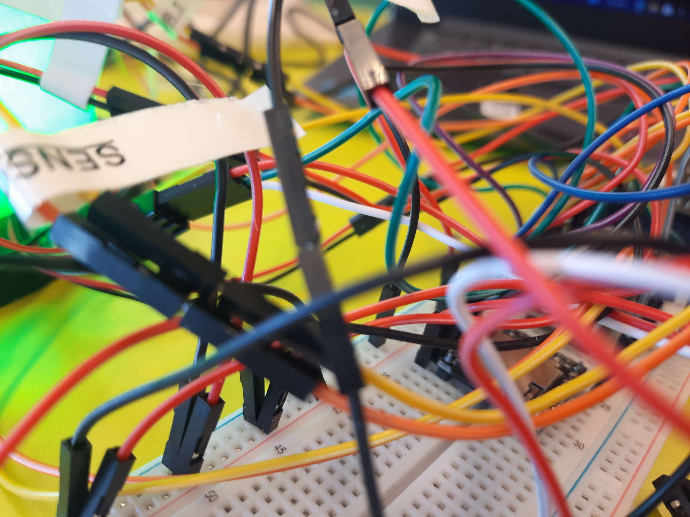
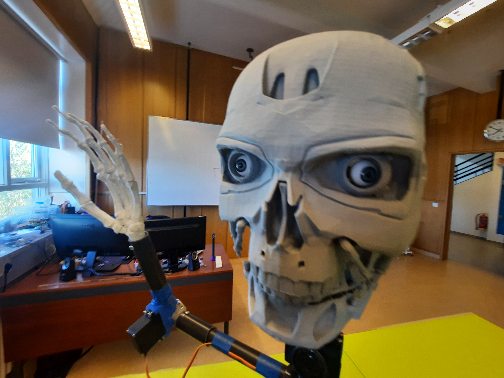
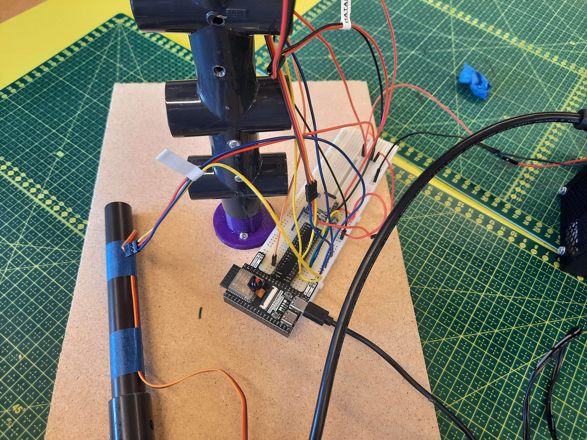
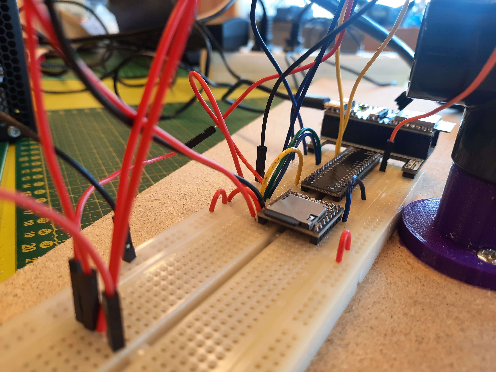

# lokaverkefni-VESM2V-05CU

1. Stutt myndband (mp4) af senu og virkni.

2. Stutt lýsing og höfundar.
Verkefnið snýst um Terminator og Beacon ljósakerfi sem vinna saman til að skynja og bregðast við nálægð. Þetta er gagnvirkt vélmenni og öryggiskerfi sem nota skynjara, ljós og hljóð til að greina og viðvara umhverfisáreiti. RFID Geta kvekja og slökkva beacon-ið

Terminatorinn:
  - Hefur LED augu sem gefa frá sér lýsingu.
  - Hreyfir höfuðið til hægri og vinstri með mótor.
  - Hefur hátalara til að "tala" eða gefa frá sér hljóð.
  - Hefur 2 hendur.

Beacon ljósið:
  - Inniheldur LED ljós sem breyta litum eftir nálægð.
  - Hefur hátalara sem gefur frá sér viðvörunartón.
  - Notar marga skynjara á kringum sig til að greina nálægð fólks eða hluta.
  - Kallar í Terminatorinn þegar hætta eða nærvera er greind.
  - RFID Geta kvekja og slökkva beacon-ið

Virkni:
  - Enginn nálægt: Grænt ljós lýsir.
  - Nálægð greind: Ljósið verður appelsínugult.
  - Mjög nálægt: Ljósið blikkar rautt og hátalari gefur frá sér viðvörunartón.

4. Ljósmyndir af mekaník, samsetningu á leikmunum.

5. Íhlutalisti, allir íhlutir sem notaðir eru í verkefnið.
   - PVC pípur
   - Rasberry pi
   - 1 mótor servo fyrir hálsinn og 2 mótor servo fyrir hendurnar
   - 2 DFP Player fyrir hljóðið(1 fyrir terminator og 1 fyrir beacon)
   - 2 led fyrir augu 
   - 3 ESP32(1 fyrir terminator og 1 fyrir beacon)
   - 3 breadboard(1 fyrir terminator og 1 fyrir beacon)
   - ID Skynjari
     
        Appelsínugult – 4, Hvít – 5, Cyan – 7, Fjólublátt – 3, Blátt – 9, Gult – gnd, Brúnt – 3.3v
     (skynjarakóðinn er í Terminator ESP32, copy paste í beacon ESP32)

   - 4 skynjara á kringum beacon
   - 2 Hátalari(1 fyrir terminator og 1 fyrir beacon)
   - NeoPixel rings
   - 3d prentuð terminator höfuð
   - 3d prentuð beacon

# Myndir

python"""from mqtt_as import MQTTClient, config
import asyncio
from machine import Pin
from neopixel import NeoPixel
import random
from servo import Servo
import json
from time import sleep_ms

from lib.dfplayer import DFPlayer

neo = NeoPixel(Pin(2), 2)  # 2x LED

neck_servo = Servo(Pin(7))
handL_servo = Servo(Pin(5))
handR_servo = Servo(Pin(6))

# WIFI settings
config["ssid"] = "TskoliVESM"
config["wifi_pw"] = "Fallegurhestur"

# MQTT Broker settings
config["server"] = "10.201.48.77"  
config["queue_len"] = 1
TOPIC_SENDING = "1130kynning"

interval = 0  
isOn = "No"

df = DFPlayer(2)
df.init(tx=17, rx=16)

reacting = False

async def h_left(): #haus vinstri
    for angle in range(0, 145 + 1):
        neck_servo.write_angle(angle)
        await asyncio.sleep_ms(5)
    print("Neck fully 'extended'")
    
async def h_right(): #haus hægri
    for angle in range(145, 0 - 1, -1):
        neck_servo.write_angle(angle)
        await asyncio.sleep_ms(5)
    print("Neck fully 'retracted'")
    
async def left_hand_up(): #vinstri hendi upp
    for angle in range(0, 145 + 1):
        handL_servo.write_angle(angle)
        await asyncio.sleep_ms(1)
    print("Neck 'X' axis fully 'retracted'")
    
async def left_hand_down(): #vinstri hendi niður
    for angle in range(145, 0 - 1, -1):
        handL_servo.write_angle(angle)
        await asyncio.sleep_ms(1)
    print("Neck 'X' axis fully 'retracted'")
    
async def right_hand_up(): #hægri hendi upp
    for angle in range(0, 145 + 1):
        handR_servo.write_angle(angle)
        await asyncio.sleep_ms(1)
    print("Neck 'X' axis fully 'retracted'")
    
async def right_hand_down():#hægri hendi niður
    for angle in range(145, 0 - 1, -1):
        handR_servo.write_angle(angle)
        await asyncio.sleep_ms(1)
    print("Neck 'X' axis fully 'retracted'")
    
async def hreyfa_haus(): #hreyfa_haus vinstri svo hægri
    for angle in range(72, 145 + 1):
        neck_servo.write_angle(angle)
        await asyncio.sleep_ms(5)

    for angle in range(145, 0 - 1, -1):
        neck_servo.write_angle(angle)
        await asyncio.sleep_ms(5)

    for angle in range(0, 72 + 1):
        neck_servo.write_angle(angle)
        await asyncio.sleep_ms(5)

async def hreyfa_hendur(): #hreyfa hendur
    for angle in range(0, 145 + 1):
        handL_servo.write_angle(angle)
        handR_servo.write_angle(angle)
        await asyncio.sleep_ms(5)

    for angle in range(145, -1, -1):
        handL_servo.write_angle(angle)
        handR_servo.write_angle(angle)
        await asyncio.sleep_ms(5)

async def nalaegt(): #ef distance er < 50
    global reacting

    reacting = True

    while distance < 50:
        await df.wait_available()
        await df.volume(20)
        await df.play(1, 1)

        await asyncio.gather(
            hreyfa_haus(),
            hreyfa_hendur()
        )

        await asyncio.sleep_ms(100)  

    reacting = False

async def mottakari(client):
    global distance, reacting

    async for topic, skilabod, _ in client.queue:
        decoded_topic = topic.decode()
        decoded_msg = skilabod.decode()
        print("Received:", decoded_topic, decoded_msg)

        if decoded_topic == "fjarlaegd":
            try:
                distance = int(decoded_msg) #finna fjarlægð frá öðrum esp
                print(f"Distance: {distance}")

                if distance > 80: # ef fjarlægrðin er meira en 80
                    neo[0] = (0, 0, 0)
                    neo[1] = (0, 0, 0)
                    neo.write()
                    #ekkert
                elif 50 < distance <= 80: #ef fjarlægð milli 50 og 80
                    neo[0] = (0, 255, 0)
                    neo[1] = (0, 255, 0)
                    neo.write()
                    #kveikja ljós
                elif distance <= 50: #ef fjarlægð minna en 50
                    neo[0] = (0, 255, 0)
                    neo[1] = (0, 255, 0)
                    neo.write()
                    if not reacting:
                        print(">> Starting new reaction task")
                        asyncio.create_task(nalaegt())
                        #robot goes psycho
            except ValueError:
                print("Invalid distance value")

        elif decoded_topic in actions:
            await actions[decoded_topic]() #allt frá node red

        else:
            print(f"Unknown topic: {decoded_topic}")
        
async def sendir(client, skilabod):
    global isOn, interval
    while True:
        message = json.dumps({"status": isOn, "interval": interval})
        await client.publish(TOPIC_SENDING, message.encode())
        await asyncio.sleep_ms(2000)  

async def askrift(client):
    while True:
        await client.up.wait()
        client.up.clear()
        await client.subscribe(b"#", 1) 

# allt frá Node-red
actions = {
    "h_left": h_left,
    "h_right": h_right,
    "left_hand_up": left_hand_up,
    "left_hand_down": left_hand_down,
    "right_hand_up": right_hand_up,
    "right_hand_down": right_hand_down
}

async def main(client): #hlusta fyrir topics
    await client.connect()
    asyncio.create_task(askrift(client))
    asyncio.create_task(mottakari(client))

    while True:
        await asyncio.sleep_ms(0)

MQTTClient.DEBUG = True

client = MQTTClient(config)

try:
    asyncio.run(main(client))
finally:
    client.close()
"""
